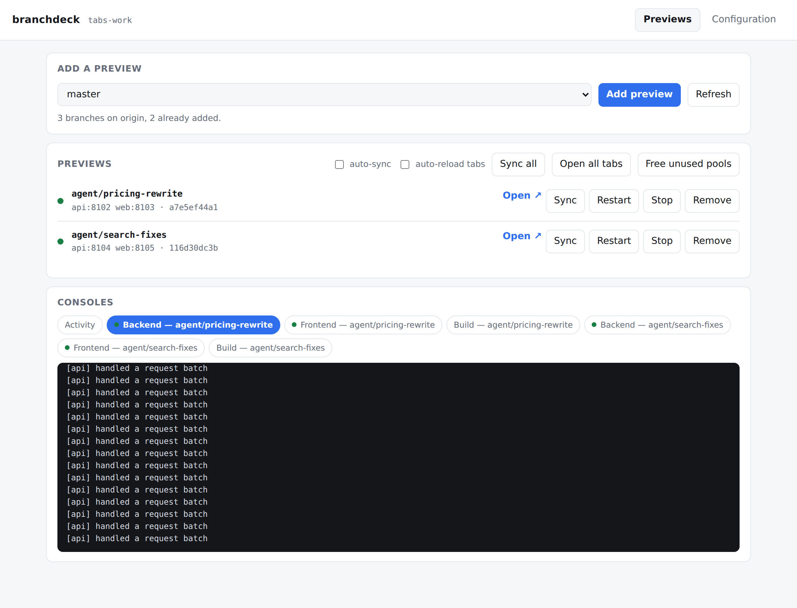
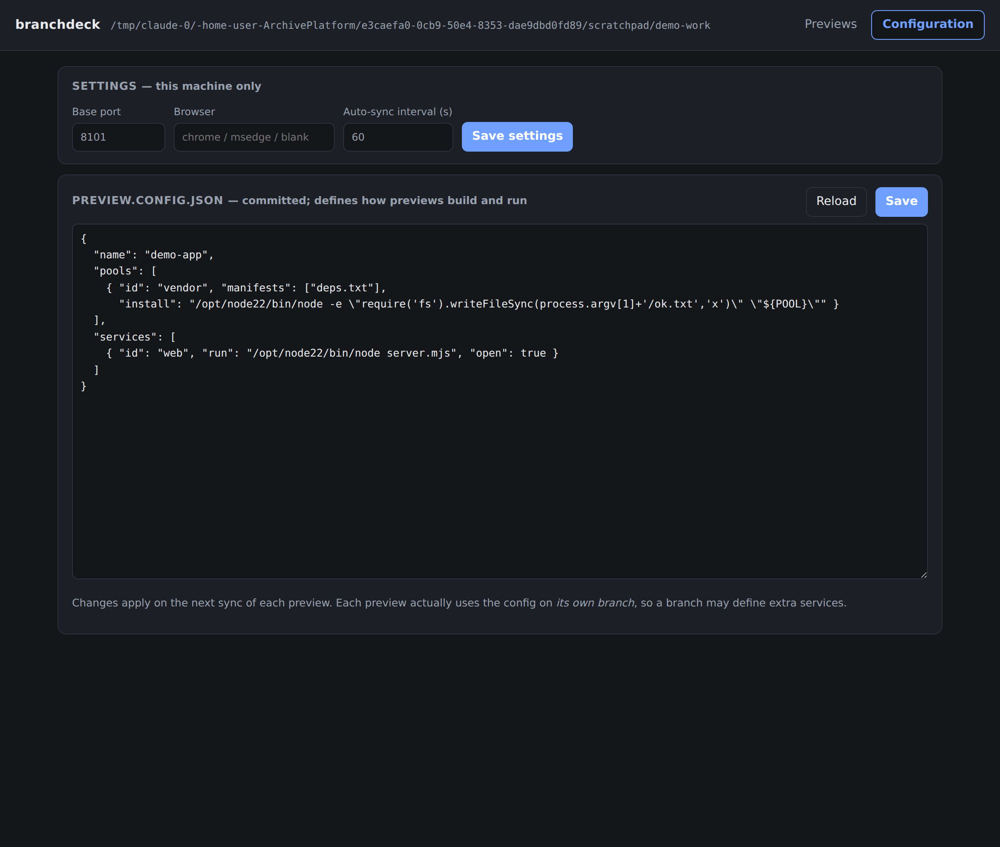

# branchdeck

**Run every git branch as its own live app in your browser — one clone, no Docker, no cloud.**

*(One clone: the local copy of your repository you already have from `git clone`.)*

<!-- badges: npm version · CI · license — add once published -->

## The problem

You've got three AI coding agents working at once — one fixing a bug, one
building a feature, one refactoring. Each pushes its work to its own
**branch** (a named line of work in git; pushing to a branch doesn't touch
anyone else's code, including your own working files). You want to actually
look at what each agent built — click around the running app, not just read
a diff or trust a commit message.

Normally that means `git checkout`ing back and forth, restarting your dev
server every time you switch, or cloning the repository three separate times
and paying for three separate installs. branchdeck skips both: it builds and
runs a live copy of each branch on its own **port** (a numbered channel other
programs use to reach it on your machine), all from the one clone you
already have. Dependency installs are shared wherever branches don't
actually differ, and when an agent pushes, branchdeck rebuilds only what
changed and can reload the tab in front of you automatically.

## What you get

- A live, running preview of any branch on `origin` (git's name for the
  remote copy of your repository, usually on GitHub), built from what was
  actually pushed — no more "works on my checkout."
- One clone. Each branch gets a **worktree** — a second copy of your
  repository's files that git itself manages, sharing the same history, so
  several branches can sit on disk at once without any of them being
  duplicated in full.
- Dependency installs shared automatically across branches that don't
  differ, so a tenth preview costs megabytes, not another gigabyte of
  `node_modules`.
- **Auto-sync** (`branchdeck watch`): checks `origin` on an interval,
  rebuilds only what changed, and restarts the affected service.
- **Auto-reload**: open tabs notice when their preview was rebuilt
  underneath them and refresh themselves.
- A browser control pane if you'd rather click than type.
- Zero runtime npm dependencies — branchdeck itself installs nothing when
  you install it.
- Windows, macOS, and Linux, tested in CI (continuous integration —
  automated tests that run on every push; 46 tests across 3 operating
  systems × Node 18/20/22 here).



## Before you start

You need:

| Requirement | Why |
| --- | --- |
| [Node.js](https://nodejs.org) 18 or newer | branchdeck itself is a Node program |
| git | branchdeck drives it directly (worktrees, fetch, etc.) |
| Python, *only if your project needs it* | for a Python backend's virtual environment (an isolated folder of installed packages, separate from any other project's) |

You do not need Docker, a cloud account, or any background service that has
to keep running. Everything branchdeck starts is an ordinary process on your
own machine, and it stops when you tell it to.

## Quick start

This is the whole golden path, start to finish. Run it from inside a clone of
your repository (a folder where `git status` works).

**1. Install branchdeck.**

```bash
npm install -g branchdeck
```

This will work once branchdeck has its first npm release. Until then, install
from source instead:

```bash
git clone https://github.com/mhumphries-wlu/BranchDeck.git
cd branchdeck
npm link
```

`npm link` puts the `branchdeck` command on your PATH (the list of folders
your terminal checks when you type a command name), pointing at this clone.
If you'd rather not touch your PATH at all, skip that step and run the file
directly instead: `node path/to/branchdeck/src/cli.mjs <command>`.

Either way, confirm it worked:

```bash
branchdeck version
```
```
0.2.0
```

**2. Go into your repository and generate a config file.** branchdeck looks
at your project and writes a starting `preview.config.json` for you:

```bash
cd path/to/your/repo
branchdeck init
```

You'll see something like:

```
[branchdeck] detected: Vite application
[branchdeck] wrote preview.config.json

Review it before your first `add` — in particular:
  - previews serve the production build via `vite preview`

Then:  branchdeck add <branch>
```

Open `preview.config.json` and skim it. The generic and
Python-API-serving-a-built-frontend templates are heavily commented; a
framework-specific preset like this one is terser, since more of the setup
is a known quantity. Either way, the TODOs branchdeck printed above (they're
only printed to your terminal, not written into the file) are the things
worth double-checking before you continue — in particular, the command that
actually starts your app.

**3. Add a preview for a branch** — this creates the worktree, installs
dependencies, builds, and starts the app:

```bash
branchdeck add agent/pricing-rewrite
```

The first one is slow — this is a real `npm ci` / `pip install` and a real
build, streamed to your terminal as it happens:

```
[branchdeck] creating worktree for agent/pricing-rewrite at ../myrepo-previews/wt/agent-pricing-rewrite ...
[branchdeck]   [agent/pricing-rewrite] installing pool node/9f2c1a3b7e21 — once for every branch with these manifests
...npm output streams here...
[branchdeck]   [agent/pricing-rewrite] building frontend ...
...build output streams here...
[branchdeck]   [agent/pricing-rewrite] ready -> http://localhost:8101
```

**4. Add another branch.** If it shares the same dependency manifests
(`package-lock.json`, `requirements.txt`, etc. — the files listing your
exact dependency versions), this one skips the install step entirely — it
reuses the install already sitting in the shared pool:

```bash
branchdeck add agent/search-fixes
```

```
[branchdeck] creating worktree for agent/search-fixes at ../myrepo-previews/wt/agent-search-fixes ...
[branchdeck]   [agent/search-fixes] using shared pool node/9f2c1a3b7e21 (no install needed)
[branchdeck]   [agent/search-fixes] building frontend ...
[branchdeck]   [agent/search-fixes] ready -> http://localhost:8102
```

**5. Open them in your browser:**

```bash
branchdeck open
```

This opens one browser tab per preview that has a port allocated — whether
or not its server happens to be running at that moment — at the address of
whichever service is marked `"open": true` in the config (or the first
service, if none is marked). Each tab points at its own `localhost` address
— `localhost` means your own computer, addressed the way a website would be.

**6. Keep them live as the agents keep pushing:**

```bash
branchdeck watch
```

branchdeck runs one full sync immediately, then keeps checking `origin`
every 60 seconds (configurable, minimum 10). Whenever a branch has new
commits, it resets that branch's worktree to match `origin` exactly,
rebuilds only what changed, and restarts that preview. Leave this running in
a terminal window while you work; `Ctrl+C` stops the watcher (the previews
themselves keep running).

That's the whole loop. Everything past this point is detail.

## The browser control pane

If typing commands isn't your thing, `branchdeck ui` does the same job as a
web page:

```bash
branchdeck ui
```

By default this opens on port 8100 (or the next free port after that) and
launches your browser automatically; `branchdeck ui --port 9000` or
`branchdeck ui --no-open` change either behavior. On this local page (only
reachable from your own machine, never the internet) you can:

- **Add a preview** by picking a branch from a dropdown of everything on
  `origin` — branches that already have a preview are filtered out for you.
- **Control each preview** with Open, Sync, Restart, Stop, and Remove
  buttons, next to a status dot, its port(s), and the commit it's synced to.
- **Watch a live activity feed** of everything branchdeck is doing, updated
  as it happens.
- **Switch between named console tabs** — one per running service, labeled
  like `Backend — agent/pricing-rewrite` if that service sets
  `"label": "Backend"` in the config, or `web — agent/pricing-rewrite` using
  its plain `id` if it doesn't — to see exactly what that server is
  printing, without opening a terminal.
- **Toggle auto-sync** — the same job as `branchdeck watch`, without keeping
  a terminal window open, and without the lock issue described below.
- **Edit `preview.config.json`** in a text box that validates your changes
  before it lets you save, so a stray comma can't quietly break every
  preview.



The page is bound to `127.0.0.1` (your own machine only — nothing outside
your computer can reach it), and every request needs a per-run token: minted
fresh each time you start the server, required on every single request, and
printed as part of the URL when the server starts. This matters because the
page can start processes your config defines. The token, together with
checks that reject requests pretending to come from somewhere else, is what
stops a random website open in another browser tab from quietly driving it.
Treat the printed URL like a password — don't paste it anywhere public.

## How it stays cheap

Running several branches at once naively means one dependency install per
branch — `npm install` (or `pip install`) once per worktree. For a project
with a few hundred megabytes of `node_modules`, four branches means four
gigabytes, and it keeps growing as agents add more branches.

A tempting fix is symlinking (a symlink is a pointer file that makes one
location also appear at another, without copying anything) one shared
`node_modules` into every worktree — but that's actually dangerous, not just
inelegant. If two branches disagree about their dependencies (one bumped a
package, one didn't), a shared link silently runs one branch's code against
the other branch's packages. You get a bug that makes no sense, because it
isn't really your app's bug — it's a dependency mismatch wearing a disguise.

branchdeck's approach is **content-addressed pools**. Each pool is a
directory named after a hash (a fingerprint computed from a file's contents
— identical files always produce the identical hash) of the exact manifest
files that produced it:

```
myrepo-previews/pool/node/9f2c1a3b7e21/node_modules   ← from this package-lock.json + package.json
myrepo-previews/pool/py/3ab77e19f402/venv             ← from this requirements.txt
```

Two branches whose manifest files are byte-for-byte identical hash to the
same directory name, so they automatically share one install — nothing to
configure. A branch that changes a manifest hashes to a different name and
gets its own pool, installed fresh — unless some other branch already built
a pool with that exact hash, in which case this branch reuses it too, even
though its own lockfile just changed. There's no flag for this and no way to
end up running against the wrong dependencies — the directory name is the
guarantee.

Ten branches with the same lockfile cost roughly one install's worth of
disk, not ten. Branches that genuinely diverge cost what they should: their
own install, and nothing more.

Linking a pool into the worktree is optional and stack-specific: the Node
presets link `node_modules` in as a **junction** on Windows (a kind of
directory link that doesn't need administrator rights) or a symlink on
macOS/Linux, so your build tool finds it in the normal place. The Python
presets don't link anything at all — the virtual environment (the isolated
package folder mentioned above) stays inside the pool, and services reach it
directly via `${POOL:py}/venv/${BIN}/python`.

## Auto-sync and auto-reload

**`branchdeck watch`** checks `origin` on an interval
(`watchIntervalSeconds` in settings, default 60 seconds, minimum 10) and,
for every branch with new commits:

1. Resets that branch's worktree to exactly match `origin/<branch>` and
   removes any files git doesn't track there. Files git already ignores —
   installed dependencies, build output, your env file — are left alone.
2. Reinstalls dependencies only for a pool that doesn't already exist under
   its content hash: a lockfile-only pool skips `npm ci` entirely if the
   lockfile's content hasn't changed, and even a changed lockfile costs
   nothing if some other branch already built that exact pool.
3. Re-runs a build step when it's never run before, when its declared output
   is missing, or after a force-push; a step with no `when` list re-runs on
   every new commit, while a step with a `when` list only re-runs when a
   file under one of those paths actually changed.
4. Restarts the service so it's serving the new build.

It runs one full sync immediately when you start it, then continues on the
interval. A commit that only touches the backend never triggers a frontend
rebuild — branchdeck compares the actual changed files, not just "something
happened."

**`branchdeck watch` holds branchdeck's lock for as long as it runs.** While
it's up, every other `branchdeck` command in that repository — even from
another terminal — fails with "another branchdeck command is running."
Stop the watcher first, or use the control pane's auto-sync toggle instead,
which locks only for the duration of each individual sync rather than
holding the lock continuously.

> **Don't edit files inside a preview's worktree.** The next sync resets it
> to match `origin`, discarding anything you changed by hand — including a
> preview's copy of a generated env file (a plain-text file holding
> configuration and secrets your app reads at startup, typically named
> `.env`), which is rewritten on every sync. If you need to change a value,
> edit the source file in your own clone — the one named in `copyFrom` — not
> the preview's copy.

**Auto-reload** closes the last gap: the tab sitting open in your browser.
Add a `reload` block to your config (`branchdeck init` includes one for
presets where it applies) and branchdeck writes a small revision file into
your build output on every sync, writes a tiny watcher script
(`branchdeck-reload.js`) beside it, and makes sure your built HTML includes
a `<script src="...">` tag pointing at that watcher.

The watcher polls the revision file every few seconds and reloads the page
when it changes — the same idea as tools like LiveReload, without a proxy in
front of your app. The watcher lives in its own file, referenced by a plain
`<script src>` rather than pasted inline into the page. That matters because
real apps often send a `Content-Security-Policy: script-src 'self'` header,
which silently blocks inline scripts while still allowing an external
same-origin file like this one.

It works for a tab opened by `branchdeck open`, a bookmark, or a URL you
typed by hand — nothing needs to hold a reference to the window — and it
re-checks whenever you click back into the tab, so switching to a preview
you left open shows the current code immediately.

Turn it off per-branch by removing the `reload` block, or globally with
`"autoReload": false` in `<repo>-previews/settings.json`.

**Auto-reload doesn't apply to every app.** It works by injecting a script
tag into a static HTML file your build produces. An app with no such file —
most notably a Next.js app running in production mode (`next start`) — has
nothing to inject into, so this feature has no effect there. Sync and
rebuild still work fine; you'll just need to refresh the tab yourself.

## Seeing your servers' output

Every preview's server runs as a hidden background process — no console
window popping up per branch, nothing you can accidentally close and kill
your app.

**Server output — always name the service, even if there's only one:**

```bash
branchdeck logs agent/pricing-rewrite web --follow
```

`branchdeck logs <branch>` on its own, with no service name, shows the
*install and build* log for that preview — useful for diagnosing a failed
setup, but it never includes anything your running server itself prints.
`-f` is shorthand for `--follow`; drop it to just print the last 80 lines
and exit.

**Open one terminal tab per running service:**

```bash
branchdeck consoles
```

On Windows with [Windows Terminal](https://aka.ms/terminal) installed, this
opens one tab per service, each titled like `Backend — agent/pricing-rewrite`
(using the service's `label` if it set one, otherwise its `id`) so you
always know which server you're looking at. Without Windows Terminal it
falls back to separate titled console windows. On macOS/Linux it prints the
`tail -f` command for each service instead of opening a window, since
there's no universal "new terminal tab" command across terminal apps.

The browser control pane shows the same consoles as clickable tabs, so you
rarely need a terminal for this at all.

## Commands

| Command | What it does |
| --- | --- |
| `branchdeck init [--force]` | Detect your stack, write `preview.config.json` |
| `branchdeck add <branch>` | Create a preview for a remote branch and start it |
| `branchdeck sync [<branch>\|--all]` | Fetch, rebuild what changed, restart |
| `branchdeck watch` | Poll `origin` and auto-sync previews as branches move (holds the lock the whole time — see [above](#auto-sync-and-auto-reload)) |
| `branchdeck open [<branch>]` | Open a browser tab per preview with an allocated port |
| `branchdeck status [--offline]` | Table: ports, running services, sync state, sharing |
| `branchdeck stop [<branch>\|--all]` | Stop a preview's servers (keeps the worktree) |
| `branchdeck restart [<branch>]` | Rebuild if needed and restart, without waiting for new commits |
| `branchdeck logs <branch> [service] [--follow\|-f]` | Print or live-stream a console (name the service for server output) |
| `branchdeck consoles [<branch>]` | Open a named terminal tab per running service |
| `branchdeck remove <branch>` (alias `rm`) | Delete a preview (shared pools are kept) |
| `branchdeck gc` | Delete dependency pools no remaining preview references |
| `branchdeck ui [--port N] [--no-open]` | Open the browser control pane |
| `branchdeck help` / `branchdeck version` | Usage / version — work from anywhere |

Add `--verbose` to any command for extra diagnostic detail when something
fails. Every command except `help` and `version` needs to be run from inside
a clone of your repository. Branch names must start with a letter or digit
and may contain letters, digits, dots, underscores, dashes, and slashes —
anything else is refused before branchdeck touches git.

## Configuration guide

`preview.config.json` lives in your repository root, next to `package.json`
or `requirements.txt`. `branchdeck init` writes a starting one for your
stack automatically — you don't need to write this by hand, but it helps to
know what each section does when you want to change something.

You can commit it (the usual choice — previews then behave the same for
everyone, and a branch can even add its own service by shipping its own
copy), or keep it untracked via `.git/info/exclude` (a per-clone ignore file
that never gets committed). If a worktree has no config of its own,
branchdeck falls back to the one in your main clone.

**`pools`** — shared, content-addressed dependency installs (see
[How it stays cheap](#how-it-stays-cheap)):

```jsonc
"pools": [
  {
    "id": "node",
    "manifests": ["package-lock.json", "package.json"],
    "install": "npm ci",
    "link": { "node_modules": "${POOL}/node_modules" }
  }
]
```

A pool can also set `"installIn": "worktree"` (run the install command in
the branch's own folder instead of the pool's directory) and its own `env`
for that install command.

**`build`** — steps that only re-run when the files they watch actually
changed between the old and new commit:

```jsonc
"build": [
  { "name": "build", "run": "npm run build", "when": ["src"], "output": "dist" }
]
```

Build steps also accept a `cwd`, same as services below.

**`reload`** — turns on auto-reload for any tab showing this preview (see
[Auto-sync and auto-reload](#auto-sync-and-auto-reload)):

```jsonc
"reload": {
  "injectInto": ["dist/index.html"],
  "intervalSeconds": 3
}
```

**`services`** — one entry per process branchdeck should run, each on its
own free port:

```jsonc
"services": [
  {
    "id": "api",
    "label": "Backend",               // names the console tab "Backend — <branch>"; without it, falls back to "api — <branch>"
    "run": "node server.js",          // ${PORT} and the PORT env var are both set
    "cwd": "backend",                 // run this command from a subdirectory of the worktree
    "env": { "NODE_ENV": "production" },
    "health": { "path": "/healthz" }, // optional; default is just "did it accept a connection"
    "open": true                       // which service `branchdeck open` opens
  }
]
```

**`envFiles`** — copies an untracked env file from your clone (never
committed) into each preview, then appends preview-specific values:

```jsonc
"envFiles": [
  {
    "path": ".env",
    "copyFrom": [".env"],
    "set": { "PREVIEW_BRANCH": "${BRANCH}" },
    "appendToCsv": { "ALLOWED_ORIGINS": ["http://localhost:${PORT:web}"] }
  }
]
```

`appendToCsv` is for settings your app reads as a comma-separated list, like
an allowed-origins or allowed-hosts setting — it adds this preview's own
address to whatever's already there instead of replacing it. Remember: the
generated file is rewritten on every sync — edit the source file named in
`copyFrom`, in your own clone, never a preview's copy directly.

### Machine-local settings

`<repo>-previews/settings.json` holds things that are yours, not the
project's — each person previewing this repository can set their own:
`basePort` (where port allocation starts, default 8101), `browser`
(`"chrome"`, `"msedge"`, …, or unset for your OS default),
`watchIntervalSeconds`, `autoReload` (master switch for the reload
watcher), `autoReloadTabs` (re-navigate tabs the control pane opened),
`env` (extra environment variables added to every service), and `uiPort`
(which port `branchdeck ui` prefers, default 8100).

### Where placeholders work

Placeholders like `${PORT}` only expand in specific places — not just
anywhere in the file:

- Command strings (a pool's `install`, a service's `run`)
- `env` blocks
- A pool's `link` targets
- `envFiles`' `set` and `appendToCsv` values
- A service's `health.path` — though this one expands with an empty
  context (no port or branch is available yet at that point), so `${PORT}`
  there stays as the literal text `${PORT}` rather than resolving

Path-shaped keys — `cwd`, `output`, `when`, a pool's `manifests`,
`envFiles[].path` — are used exactly as written, with no expansion at all.
More generally, a placeholder referencing something unavailable in its
context is left alone as literal text rather than causing an error.

Where they do expand, these are available:

| Placeholder | Expands to |
| --- | --- |
| `${PORT}` | This service's own port (also set as the `PORT` environment variable) |
| `${PORT:id}` | Another service's port — for wiring a frontend to its backend |
| `${POOL}` | The current pool's directory (only valid inside that pool's own `install`/`link`) |
| `${POOL:id}` | Another pool's directory, by its `id` |
| `${WORKTREE}` | This preview's worktree folder |
| `${REPO}` | Your main clone's folder |
| `${DECK}` | The `<repo>-previews` state folder |
| `${BRANCH}` | The branch name, exactly as it appears on `origin` |
| `${SLOT}` | The branch name, made filesystem-safe (for database names, etc.) |
| `${MANIFEST}` | The first manifest file of the pool currently being installed |
| `${BIN}` | `Scripts` on Windows, `bin` everywhere else — for virtualenv paths |

Giving each preview its own database, so agents' branches don't collide over
shared data:

```jsonc
"set": {
  "DB_NAME": "preview_${SLOT}"
}
```

### Presets `init` can detect

<details>
<summary>Expand — which stacks are auto-detected and what each one generates</summary>

| Stack | What it generates |
| --- | --- |
| Next.js | `next build` then `next start` |
| Vite | build, then `vite preview` |
| Create React App | build, then serves it with `npx serve` |
| Django | migrate, then `manage.py runserver` |
| Generic Python | a virtualenv-based preset with a TODO for your start command |
| Generic Node | `npm start`, assuming your app binds `${PORT}` |
| Python API serving a built SPA (single-page app — a frontend whose backend serves the already-built files) | one Python process serving frontend + backend together |
| Anything else | a commented generic template with TODOs, rather than a guess |

The generic and Python-API-serving-a-SPA templates are the most heavily
commented, since they cover the widest range of unknowns; the
framework-specific presets above them are terser.

</details>

## Things to know

These aren't bugs — they're how the tool works, and worth knowing before you
rely on it:

- **`preview.config.json` runs shell commands, by design** — the same way an
  `npm run` script does. If a pull request modifies this file, treat it as
  code and review it before you preview that branch. branchdeck will happily
  run whatever it says.
- **All previews share whatever your app connects to** — usually the same
  local database — unless you separate them. Use `envFiles` with `${SLOT}`
  (shown above) to give each preview its own database name, queue, or
  similar.
- **A preview shows what was pushed to `origin`**, not your own uncommitted
  changes. If an agent hasn't pushed yet, `branchdeck add`/`sync` won't see
  its latest work.
- **Don't edit files inside a preview's worktree, or its generated env
  file, by hand.** The next sync resets the worktree to match `origin` and
  rewrites the env file from scratch. Files git already ignores — installed
  dependencies, build output — survive; anything else you changed yourself
  doesn't.
- **The first `branchdeck add` for any branch is slow** — it's a real
  install and a real build. Branches added afterward that share the same
  dependency manifests skip the install step and are much faster.
- **The first `add` for a branch still needs whatever your app itself
  needs** — an env file with real credentials, a database that's actually
  running, and so on. branchdeck runs your app; it doesn't substitute for
  its requirements.
- **Auto-reload needs a static HTML file to inject into.** It doesn't work
  for server-rendered apps with no build output file, like Next.js running
  in production mode.
- **`branchdeck remove` keeps shared pools** — that's what makes re-adding a
  branch fast later. Run `branchdeck gc` when you actually want to free the
  disk space of pools nothing uses anymore.

## Troubleshooting

| Symptom | What's going on | Fix |
| --- | --- | --- |
| `ERROR: not inside a git repository` | branchdeck couldn't find a `.git` folder from your current directory | `cd` into your clone first. `branchdeck help` and `branchdeck version` work from anywhere, everything else needs to run inside the repo. |
| `python -m venv` fails | The `python` on your PATH isn't a real interpreter — often the Microsoft Store's placeholder, or a conda base environment that doesn't behave like a normal one | Edit the `install` lines for that pool in `preview.config.json` to call a specific interpreter, e.g. `py -3.11 -m venv "${POOL}/venv"` |
| `npm install -g branchdeck` says "up to date" but you're missing a feature you expected | npm skips reinstalling a package it thinks is already the same version | `npm uninstall -g branchdeck`, then install again. On the from-source path, re-run `npm link` after pulling the latest commits into your clone, and confirm what's actually linked with `branchdeck version`. |
| Long silence after `branchdeck add`, nothing seems to be happening | It's installing dependencies or running your build — this is genuinely slow the first time, and output streams to your terminal as it happens | Don't press `Ctrl+C`. An interrupted install is detected and redone on the next run, but it wastes the time you already spent waiting. |
| A preview never becomes healthy | branchdeck gives up and reports failure after 3 minutes; the usual cause is a missing environment variable or a database that isn't running | `branchdeck logs <branch> <service>` — the actual startup error from your app is almost always in there (remember: the log without a service name only shows install/build output) |
| Login or a form submission gets rejected on a preview, often mentioning CORS or CSRF (browser security checks that reject requests from an origin your app doesn't recognize) | Your app doesn't recognize the preview's own `localhost:PORT` as a trusted origin | Add the preview's origin to whatever allowlist your app checks, via `appendToCsv` in `envFiles` (see the config example above) |
| `EADDRINUSE` / "port already in use" | branchdeck checks a port is free before handing it out, but a server from a previous branchdeck run that didn't shut down cleanly can still be holding it | `branchdeck restart <branch>` stops branchdeck's own recorded process and waits for the port to free up. If some *other*, unrelated process now owns that port, restart can't help — branchdeck refuses to kill a process it didn't start. Close that process yourself, or `branchdeck remove` the preview and `add` it again to get a fresh port. |
| `another branchdeck command is running (pid ...)` | `branchdeck watch` holds branchdeck's lock for its entire run, so no other branchdeck command in that repo can proceed while it's up. The control pane's auto-sync toggle doesn't have this problem — it locks only per sync. | Stop the watcher, or use the pane's auto-sync toggle instead. If nothing is actually running (e.g. after a crash), delete `<repo>-previews/.lock`. |

## How it works under the hood

<details>
<summary>Expand — worktrees, pools, ports, and where files actually live</summary>

branchdeck is built entirely on things git and your operating system already
provide.

- **Worktrees.** Each preview gets its own [`git
  worktree`](https://git-scm.com/docs/git-worktree) — a second copy of your
  repository's files, managed by git, sharing the same underlying history
  and object store so nothing is duplicated except the files that actually
  differ. branchdeck pins each one to `origin/<branch>`, detached (not
  attached to any local branch of its own), so it always tracks what's on
  the remote rather than anything you have checked out locally. Git itself
  records that a worktree exists under `.git/worktrees/` inside your clone
  — that bookkeeping is git's, not something branchdeck adds elsewhere.
- **Pools.** Dependency installs live outside any worktree, named by a hash
  of the manifest files that produced them, and — where the stack calls for
  it — linked into the worktree as a directory junction or symlink (see
  [How it stays cheap](#how-it-stays-cheap)).
- **Ports.** Each service in each preview claims the next free port starting
  from a base (`8101` by default), tested by actually trying to bind it
  before handing it out.
- **Almost nothing else lives inside your repository.** The one exception is
  `preview.config.json` itself, which `branchdeck init` and the control
  pane's editor both write into your repo root, same as any other project
  file. Everything else branchdeck creates — worktrees, pools, logs, its own
  bookkeeping — lives in a sibling folder next to your clone,
  `<repo>-previews/`:

```
myrepo/                        your clone
  preview.config.json          the one file branchdeck writes inside your repo
myrepo-previews/
  wt/<slot>/                   one worktree per preview (slot = branch name, sanitized: feat/one -> feat-one)
  pool/<id>/<hash>/            shared dependency installs
  logs/<slot>.log              install and build output, plus start/stop records
  logs/<slot>.<service>.log    one live console per service
  state.json                   which previews exist, their ports, their synced commit
  settings.json                machine-local settings
  .lock                        held for as long as a branchdeck command is running
```

`git status` inside your clone stays as clean as it would without
branchdeck, aside from `preview.config.json` — which you'd typically commit
anyway.

</details>

## Uninstalling / cleaning up completely

1. Remove every preview — this stops its servers and unlinks its pools.
   `stop --all` plus `gc` on their own free nothing, because `gc` only
   deletes pools that no *existing* preview still references:
   ```bash
   branchdeck remove agent/pricing-rewrite
   branchdeck remove agent/search-fixes
   # ...repeat for each; `branchdeck status` lists what's left
   ```
2. Free the now-unused pools:
   ```bash
   branchdeck gc
   ```
3. Delete the previews folder — it's a sibling of your clone, not inside it,
   so this doesn't touch your repository's files or history:
   ```bash
   rm -rf ../myrepo-previews
   ```
   ```powershell
   # Windows PowerShell
   Remove-Item -Recurse -Force ..\myrepo-previews
   ```
4. Tell git to forget any worktrees you just deleted by hand:
   ```bash
   git worktree prune
   ```
   `branchdeck remove` already does this for each preview it removes, but
   deleting the folder directly (step 3) skips that bookkeeping and can
   leave stale worktree registrations behind — this cleans those up.
5. Remove the global command:
   ```bash
   npm uninstall -g branchdeck
   ```
   If you installed from source with `npm link`, run `npm unlink -g
   branchdeck` instead, or simply delete your clone of the branchdeck repo.

If you'd rather keep `preview.config.json` out of your repository entirely,
delete it, or move it and list it in `.git/info/exclude` instead of
committing it.

## Prior art

[`git worktree`](https://git-scm.com/docs/git-worktree) is the foundation
everything else here is built on.
[Portree](https://github.com/fairy-pitta/portree) manages dev servers for
worktrees you create yourself, with subdomain-based routing between them.
[pnpm](https://pnpm.io/git-worktrees) solves dependency duplication for Node
projects that adopt it specifically. branchdeck's contribution is combining
branch provisioning, per-branch servers, and *language-agnostic,
correctness-preserving* dependency sharing into one tool that doesn't care
what stack your project uses.

## License

MIT
